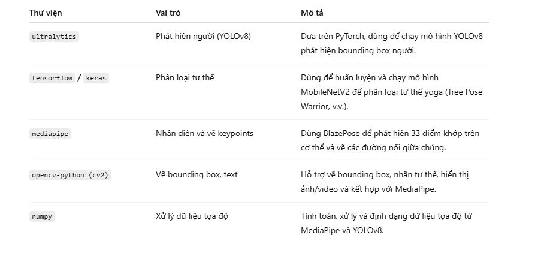

## Hệ thống nhận diện và phân loại tư thế yoga
Các thuật toán được sử dụng trong mã nguồn và các thư viện dùng để vẽ cây (cụ thể là tư thế Tree Pose hoặc các điểm khớp được trực quan hóa như một "cây" các đường nối keypoints). Vì báo cáo không đề cập đến việc vẽ "cây" theo nghĩa cấu trúc dữ liệu (như cây nhị phân), tôi giả định bạn đang hỏi về việc trực quan hóa các điểm khớp và đường nối của tư thế yoga (đặc biệt là Tree Pose) bằng cách sử dụng MediaPipe để vẽ các đường nối giữa các keypoints, tạo thành một dạng "cây" mô tả cấu trúc cơ thể.

🛠️ Các thuật toán và mô hình chính
1. YOLOv8 – Phát hiện người
CNN: Trích đặc trưng ảnh

NMS: Lọc bounding box trùng

CIoU Loss / Cross-Entropy Loss: Huấn luyện

Vai trò: Xác định vị trí người trong ảnh (Tree Pose hoặc khác)

2. MobileNetV2 – Phân loại tư thế
Depthwise Separable Convolution: Nhẹ, nhanh

Transfer Learning: Dựa trên ImageNet

Softmax + Categorical CrossEntropy

Vai trò: Phân loại ảnh người đã cắt ra thành Tree Pose hoặc tư thế khác

3. MediaPipe BlazePose – Nhận diện và vẽ điểm khớp
33 keypoints được trích từ ảnh/video

Regression, heatmap, line drawing

Vai trò: Tạo trực quan hóa bằng cách nối các keypoints → như “cây cơ thể”

📊 Quy trình tổng thể: Vẽ “Cây” cho Tree Pose
Phát hiện người: YOLOv8 → Bounding Box

Phân loại tư thế: MobileNetV2 → “Tree Pose”

Nhận diện keypoints: MediaPipe BlazePose → 33 điểm

Trực quan hóa:

MediaPipe vẽ keypoints và các đường nối

OpenCV hiển thị bounding box, nhãn và độ tin cậy
## Thư viện sài 
# HETHONGNHANDIENVAPHANLOAITUTHEYOGA
## GIẤY PHÉP 
MIT License

Copyright (c) 2023 Md. Shakil Hossain

Permission is hereby granted, free of charge, to any person obtaining a copy
of this software and associated documentation files (the "Software"), to deal
in the Software without restriction, including without limitation the rights
to use, copy, modify, merge, publish, distribute, sublicense, and/or sell
copies of the Software, and to permit persons to whom the Software is
furnished to do so, subject to the following conditions:

The above copyright notice and this permission notice shall be included in all
copies or substantial portions of the Software.

THE SOFTWARE IS PROVIDED "AS IS", WITHOUT WARRANTY OF ANY KIND, EXPRESS OR
IMPLIED, INCLUDING BUT NOT LIMITED TO THE WARRANTIES OF MERCHANTABILITY,
FITNESS FOR A PARTICULAR PURPOSE AND NONINFRINGEMENT. IN NO EVENT SHALL THE
AUTHORS OR COPYRIGHT HOLDERS BE LIABLE FOR ANY CLAIM, DAMAGES OR OTHER
LIABILITY, WHETHER IN AN ACTION OF CONTRACT, TORT OR OTHERWISE, ARISING FROM,
OUT OF OR IN CONNECTION WITH THE SOFTWARE OR THE USE OR OTHER DEALINGS IN THE
SOFTWARE.
